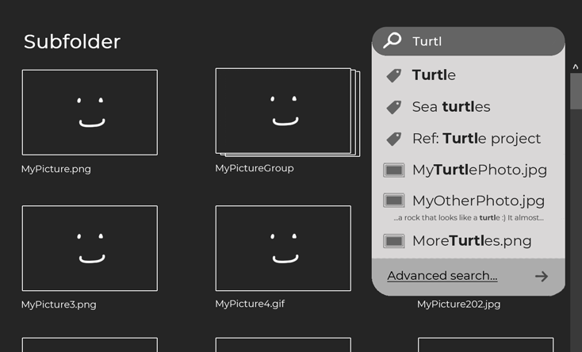
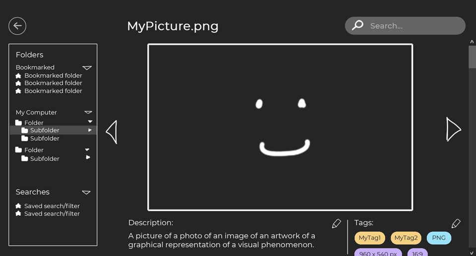
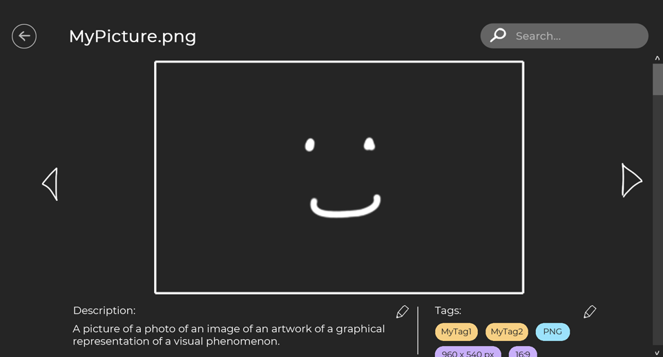

# WIP

(WIP)

Image and file organizer - browse files, add custom tags and metadata, and use them to search and group files into collections, all without modifying or copying the original files on the system.

## Mockups
 

 

## Built with

- .NET 5
- [Avalonia](https://avaloniaui.net/)
- [ReactiveUI](https://www.reactiveui.net/)
- [Dapper](https://github.com/DapperLib/Dapper)
- [NUnit](https://nunit.org/) + [Moq](https://github.com/moq/moq4)