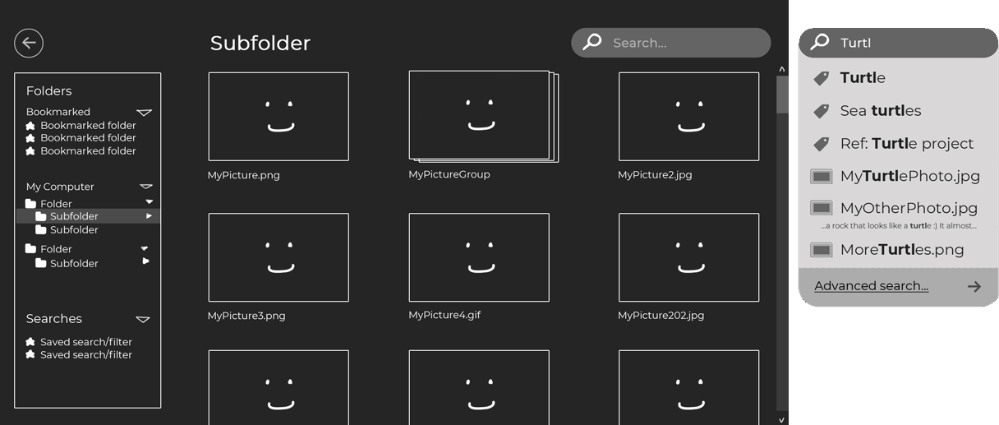

# Gallery (WIP)

Image organizer for desktop - browse and search images (and other files), group them into collections, and add custom tags and metadata without modifying the original files or keeping multiple copies of the same image on the file system.

## Screenshots (WIP)

## Mockups

## Built with

- .NET 5
- [Avalonia](https://avaloniaui.net/)
- [ReactiveUI](https://www.reactiveui.net/)
- [Dapper](https://github.com/DapperLib/Dapper)
- [NUnit](https://nunit.org/) + [Moq](https://github.com/moq/moq4)